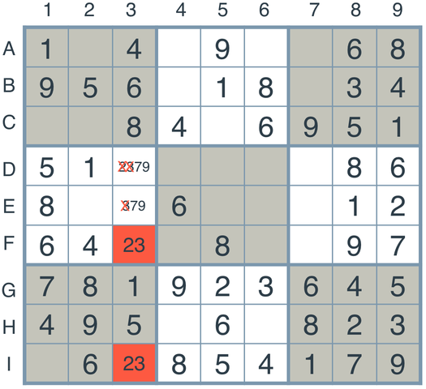
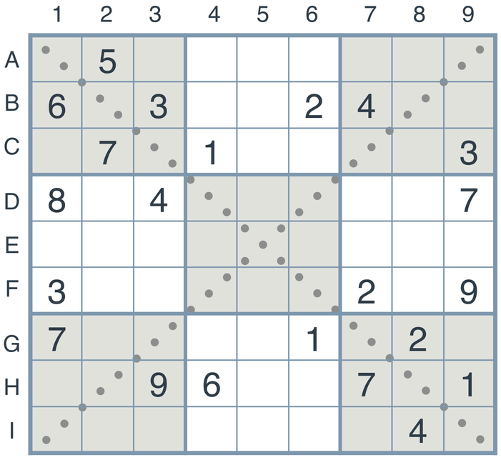

# Artificial Intelligence Nanodegree
## Introductory Project: Diagonal Sudoku Solver

For this project, I built an agent that can solve diagonal sudoku by utilizing three sudoku strategies: elimination, only-choice, and naked twins.  The elimination strategy entails removing the assigned value of known boxes from the list of possible values of the box's peers (boxes in the same column, row, or 3x3 square).  The only-choice strategy is the process of assigning a value to a box when there is only one possible value for it.  Naked twins is explained below.  I utilize depth-first search as well as constraint propagation to solve the Sudoku.

Run solution.py to test the solution!  Python 3 required.  Also make sure pygame is installed to see the visualization of the solution.

# Question 1 (Naked Twins)
Q: How do we use constraint propagation to solve the naked twins problem?  
A: We use constraint propagation to solve the naked twins problem by enforcing the constraint that no squares outside of the twins can be assigned the twin values.  

The naked twins strategy helps reduce the number of possibilities in the Sudoku problem.  As seen above, the naked twins are the boxes with '23' as possible values.  We can eliminate 2's and 3's from other boxes in the same column since these two squares must be either a 2 or 3.  

To implement this technique, first I looked for all boxes that have only two possible values and stored their ID's into a list named poss_twins.  Next, I iterated through each of these boxes and identified their peers.  If any peers were also in the poss_twins list, that means the box and the peer were naked twins, so I stored these pair of ID's into a list named twins.  Now that I had the list of twins, I looped through the common units of these twins (e.g. if the twins were in the same column, then the common units are the boxes in the same column as the two) and removed the twins' values from the list of possible values from the common units.

# Question 2 (Diagonal Sudoku)
Q: How do we use constraint propagation to solve the diagonal sudoku problem?  
A: We enforce the constraint that the squares along the main diagonals of the sudoku board must have the numbers 1-9 appear exactly once, similar to the requirements in regular sudoku for rows and columns.

To solve for the diagonal sudoku problem, all I had to do was add the two main diagonals into the list of units.  The list of units for a regular sudoku is just the column units, the row units, and the square units - every column, row, and square must have the values 1-9 in its boxes.  By adding the diagonals into the list of units, the main diagonals must also satisfy this rule in order for the Sudoku to be considered solved.  
